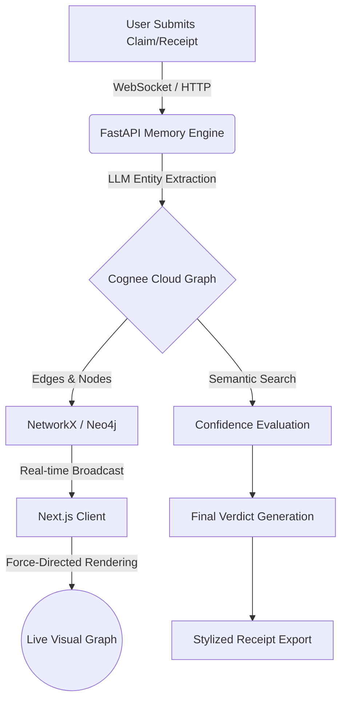

<div align="center">
  <h1>Tab Split 💸</h1>
  <p><strong>The AI-Powered Consensus Engine for Resolving Multi-Party Disputes</strong></p>
  <p><em>Built for the "Where's My Context?" AI Hackathon</em></p>
</div>

---

## 📖 Overview

**Tab Split** is a real-time, physics-based knowledge graph visualization tool that leverages LLMs and [Cognee Cloud](https://cognee.ai/) to mathematically resolve chaotic group disputes (like who owes what after a crazy night out).

Instead of arguing in a group chat, users submit their claims and upload photo evidence (receipts). The Tab Split engine maps these inputs into a semantic knowledge graph, extracting entities and corroborating relationships to generate a highly confident, objective **Verdict**.

## 🚀 Features

- **Live Knowledge Graph:** A responsive, force-directed D3 visualization that reorganizes in real-time as new evidence arrives.
- **AI Verdict Engine:** Automatically synthesizes conflicting claims into a single ground-truth centroid using OpenAI and Cognee.
- **Vegas-Style UI:** Beautiful, dynamic dark-mode interface built with Tailwind CSS and Framer Motion.
- **Exportable Receipts:** Instantly generates a stylized "Verdict Receipt" to drop into the group chat to end the argument.

---

## 🧠 Workflow Architecture



---

## 🛠️ Technology Stack

### Frontend (Client)
- **Framework:** Next.js 15 (React 19, Turbopack)
- **Styling:** Tailwind CSS & Base UI (Shadcn-inspired)
- **Animations:** Framer Motion
- **Visualization:** `react-force-graph-2d` (D3.js physics)
- **Icons:** Lucide React

### Backend (Memory Engine)
- **Framework:** FastAPI (Python)
- **AI/Knowledge Graph:** `cognee` (Cognee Cloud Integration)
- **LLM Provider:** OpenAI
- **Real-Time:** WebSockets (asyncio)

---

## ⚙️ Local Setup

1. **Clone the Repository**
   ```bash
   git clone https://github.com/daksh777f/Tab-Split.git
   cd Tab-Split
   ```

2. **Setup Environment Variables**
   - In `apps/web/.env`, set your API URL (`NEXT_PUBLIC_API_URL=http://localhost:8000`)
   - In `services/memory-engine/.env`, add your keys:
     ```env
     COGNEE_CLOUD_URL=...
     COGNEE_API_KEY=...
     OPENAI_API_KEY=sk-proj-...
     ```

3. **Install Dependencies & Run**
   The repository uses `concurrently` to boot both the Next.js frontend and FastAPI backend seamlessly.
   ```bash
   # Install root dependencies
   npm install
   
   # Boot the entire stack
   npm run dev
   ```

## ⚖️ License
MIT License. Built with ❤️ for the Hackathon.
